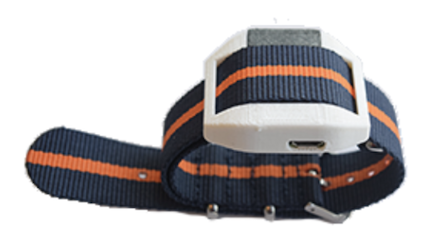

# 1 Abstract
  Human Activity Recognition has become a popular research topic in recent years with the rapidly improving capabilities of machine learning algorithms. A wrist-worn accelerometer is a popular sensor for activity recognition in research, but has a limited activity set due to its inability to differentiate between similar hand motions. In this project, an additional inertial measurement unit and a microphone was added to the user’s ear, with the purpose of aiding the wrist sensor in classifying these tasks. A convolutional neural network was implemented, and activities were classified using features extracted from a sliding time window. With the combined sensor inputs, it was possible to classify similar activities such as: eating, drinking, smoking, and scratching with an accuracy of over 98%. 
  
  - [Abstract](pages/abstract.md)

# 2 Introduction
 Human Activity Recognition (HAR) is the process of using sensors, such as accelerometers or microphones, to classify human motion into a discrete set of known activities. 	HAR has many diverse applications, and has become an extremely popular research topic in recent years. The first popular use of HAR is to recognise when elderly people fall down and seek assistance. In addition to healthcare, HAR has applications in accessibility, security, and sports. HAR systems can also be used in conjunction with traditional health sensors to help catalog data based on the activity being performed. 
Despite its many applications, HAR is an extremely difficult problem due to the typically low signal-to-noise ratio of accelerometers, the temporal dependence of the data, and the number of similar activities that arise in a natural environment and may not have been implemented. Additionally, it is difficult to generalise the problem because human movements vary from person to person. However, in recent years, machine learning has improved significantly, allowing researchers to achieve a much higher prediction accuracy in controlled environments compared to traditional classification methods.
  There is a large number of related work published, with the majority of papers focusing on wristband accelerometers and activities involving whole-body movements such as walking, sitting, lying down, and playing sports. This project seeks to differentiate itself by attempting to classify between several highly similar activities involving a combination of the arm and head. 

## Activities:
   * Eating
   * Drinking
   * Smoking
   * Scratching Head
   * Walking
   * Other
  
 The activity recognition survey in the “Related Work” section below includes a list of every activity classified by prior work [1]. Drinking, smoking, and scratching head has not been published before. In order to successfully differentiate between these activities, an additional sensor must be used to detect head movement. A 6-axis inertial measurement unit (IMU) was inserted in the user’s left ear and used in conjunction with a wristband for classification. To our knowledge, an in-ear accelerometer has not been used for activity classification yet. To further aid in differentiating the similar activities, a microphone was used to record audio data. 
  Before implementing a classification program, it is a good exercise to imagine intuitively how the activities will “look” different in the data, assuming ideal sensors with no noise or drift and an infinite sample rate. Walking will show a periodic signal in the wristband, and one of the axes will always be “negative”, easily differentiating itself from the other activities. Eating, drinking, smoking, and head scratch all involve a similar motion of bringing the hand to the head for several seconds, followed by returning to the original position. The head scratch is most similar to walking, but the frequency of the periodic motion will be much faster than walking, and the wrist axes will go from negative to positive as the hand is raised. Drinking is unique in that the user’s head will tilt backward, captured by the IMU in the ear. Eating and smoking are extremely similar from an accelerometer’s view, but the microphone can aid in classification. The fourier transform of the audio for drinking likely has most of its power in the low frequencies, while eating will be more evenly distributed. Chewing may even be detected as a periodic signal in the time domain. Intuitively, this classification problem should be solvable in a controlled environment as the selected sensors are able to find differences in every chosen activity that could be learned by a neural network. 

# 3 Related Work

## A Comprehensive Study of Activity Recognition Using Accelerometers [1]
  The purpose of this paper [1] is to survey and evaluate methods of activity recognition using accelerometers. The authors cover location of sensors, selection of activities and features, segmentation of time series data, and generalisation performance. The author found 69 unique activities, including only two of our activities: eating and walking. The paper gives an overview of several papers which used overlapping time windows. A shorter time window decreases the chance it contains more than one activity, but the data begins to lose temporal dependence. A window length of 5 to 7 seconds gave the highest prediction accuracy using a single wristband accelerometer.
The features extracted from each window can be separated into two categories: time domain and frequency domain. Time features included mean, standard deviation, and correlation. Frequency features were calculated using the fast fourier transform and included energy, entropy, and coherence. It is suggested to compute features on each axis independently.  
The survey found 10 unique sensor locations, including the wrist, but the ear/head is not included. An increased number of sensors in unique locations improves accuracy, however when the sensor count is dropped to two, the prediction accuracy only drops slightly. 
Lastly, the paper covered sensor selection. Typical human body movements have a frequency less than 15Hz. Various biaxial and triaxial accelerometers were compared, and it was found that triaxial accelerometers had a higher classification accuracy, and higher sampling rates increased power consumption with no improvement in performance. The best accuracy was found at sampling rates between 15 and 20 Hz. 

## Activity classification using a single wrist-worn accelerometer [3]
 In this paper, the researchers sought to use a single wrist-worn sensor with a sample rate of 33Hz to detect five different activities: walking, running, sitting, standing, and lying. Both a decision tree and neural network work implemented and tested. Four feature sets were tested.The best feature set included: minimum, difference, mean, st. dev., variance, and correlation, and achieved an accuracy of 90.57%. However, the decision tree outperformed the neural network with an accuracy of 94.13%. The researchers concluded that despite being able to accurately classify these vary different activities, solely data from a wrist accelerometer is not enough to classify similar activities that use the hand such as: eating, washing, or reading. They suggest adding an additional sensor ro reduce ambiguity from the accelerometer.

## Activity Recognition Using a Single Accelerometer Placed at the Wrist or Ankle [4]
  Participants wore accelerometers on both the wrist and ankle and performed 26 daily activities. 2, 4, and 12.8 second windows were tested. Ankle data showed a higher classification rate (95.0%) using features extracted from the frequency and intensity of motion. Participants were told what to do but not how to do it, attempting to account for the natural variability in how activities are performed, but resulting in slight errors in activity labeling. The sensors had a nominal sample rate of 90Hz, but many samples were dropped due to Bluetooth connection issues. To overcome this, any data windows with <80% of the expected number of samples were discarded. Since 90Hz is far higher than any human activity frequency, a 15Hz low-pass filter was used to preprocess the data. A support vector machine (SVM) was implemented for classification, and the longer window lengths had slightly higher classification accuracy.  

# 4 Technical Approach

## 4.1 System Overview
 The activity classification system can be separated into four components: Hardware, Data Pre-Processing, Classification Network, and Post-Processing. An overview of the entire system is shown in Figure 1 below. Each subsection of the system will be explored in depth in later sections. 
 

Figure 1: Overall System Diagram

## 4.2 Hardware

  The purpose of the hardware is to interface with the real world and collect data for classification. There are two hardware components involved: the eSense in-ear wearable (earable) and the MotionSense HRV wristband. The eSense has both a left and right wearable, each containing unique sensors. The right device contains a microphone and is used to record audio data for classification. The left device contains a 6-axis inertial measurement unit (IMU) ), and records absolute head position using a gyroscope and head movement using an accelerometer. The MotionSense HRV also contains a 6-axis IMU, but is mounted on the user’s wrist to record arm motion. Both sensors transmit data over BLE to a smartphone or computer. 

Figure 2: eSense In-Ear Wearable 

Figure 3: MotionSense HRV Wristband 

## 4.3 Data Collection and Experimental Results

  In order to train a predictive model one needs a dataset with instances for which predictions will be made, and the associated truth values for each instance in that dataset. To train an activity classifier using the devices described, the dataset needed is the raw IMU(accelerometer/gyroscope x,y,z axis) data from both the Earable and Wristband, the microphone data from the Earables, and the timestamp of each datapoint. The associated truth values would be a timeline of when each activity is performed. No such dataset exists, so one was generated in order to train an activity classifier. 
  One hardware issue encountered during the data collection process was time synchronization. Due to the nature of the hardware, the wristband and two eSense earables had to be connected to separate devices. This resulted in a synchronization issue among data from different sensors. To overcome this, we preceded each data collection run with a hand motion capable of generating an impulse in each datastream. The left eSense earable was held in the hand containing the wristband, and a “punch/clap” motion was performed. The resulting impulse could be seen in both the accelerometers and the audio data. By aligning these impulses, all datastreams could be synchronized. Next, the subject would perform a series of activities while an onlooker records the timestamps of the activities in the mCerebrum application.
  During data collection, there is a way to insert activity markers that appear in the data generated as timestamps of the start and end of activities. From these markers it can be determined what activity is being performed at all timestamps during data collection. Data was collected for the training, validation, and test sets separately, to ensure proper model evaluation.

Figure 5: Impulse Generated from "Clap" Motion

## 4.4 Data Pre-Processing

  The data from the hardware needs to be processed and formatted to a specific structure for the neural network to accept it as input. In addition to splitting the data into temporal “windows”, features are extracted from the raw data. The system uses a sliding window technique in which a prediction is made on a window in time. The overlapping windows allow for both a dramatically increased training data size, and the ability to smooth the classification in post-processing.
Using a convolution neural network, it is possible (and sometimes preferable) to use the raw IMU data as inputs to the network. However, our sensors had drastically varying sample rates, so this was not feasible. Instead, time features were extracted for each axis of the IMU data. The selected features include: mean, standard deviation, range, variance, and correlation among axes. These were selected based on the results in prior relevant work [2], [3]. Frequency features were also extracted from the IMU data. The FFT was calculated from 0Hz to the sampling frequency and ten frequency “bins” were calculated using the mean. 
  The audio was recorded with a sampling frequency of 8KHz. Frequency features were extracted using the Mel-Frequency Cepstrum (MFC). The MFC calculates the power spectrum over a short period of time using a logarithmic power scale based on human hearing. The first 12 coefficients of the resultant spectrum were computed over each time window. Since the MFC is computed over a much shorter time window than our classification window, the result is a 12 by 16 array of coefficients. 

Figure 6: List of Impemented Features

## 4.5 Deep Learning Classifier (Convolutional Neural Network)  

## 4.6 Data Post-Processing
  Several post-processing smoothing algorithms were implemented based on prior knowledge about the activities. For the selected activities, we assumed the user would not be performing these activities for less than 5-10 seconds. Since the windows are much shorter than this and they are overlapping, it is possible to remove erroneous activity predictions. Specifically, if there is a predicted activity shorter than 5-10 seconds, it is removed and set to the previous predicted activity. 
  A Hann window convolution in the time domain and a fifth order butterworth low-pass filter were also implemented and tested. The result was a continuous signal that could be bucketed to recover the predicted activities. While this appeared to work in some instances, it is fundamentally flawed because the activity predictions have no spatial dependence. For example, drinking and smoking are assigned integer values of 2 and 3, but are no more dependent on each other than drinking and walking (integer value 5). 

Figure 6: Example of Min Activity Length = 5s on Portion of Test Data

# 5 Experimental Results

## 5.1 Metrics
  The primary methods for analyzing the performance of our system is through confusion matrices, the classification accuracy, and the f1-score. A confusion matrix gives a visual representation of the performance of a system. The Y-axis is the actual classification, and the X-axis is the predicted classification. Thus, the diagonal from left to right are correctly classified instances. The classification accuracy is simply the number of correctly classified instances divided by the total number of instances. However, with an unbalanced dataset, classification accuracy can be misleading. For this reason, the F1-score is used to give another measure of performance. The F1 score is the harmonic mean between precision and recall. Precision is the proportion of instances that were classified correctly as some class divided by the number of instances classified as that class. Recall is the number of correctly classified instances of a class divided by the total number of actual instances of that class.
  
 

Figure 6: Sample Confusion Matrix

# 6 Conclusion and Next Steps
 Despite the high accuracy achieved by our model, it is important to note that our experimental setup is far from a real-world environment, and the classifier would most definitely struggle if not for the highly controlled setup. Throughout all of the data collected, only one activity was being performed at a time. In a real-world application, the user could be performing multiple activities at a time, such as walking and eating, which would confuse the model. These combined activities would have to be trained a new, separate, activities. Furthermore, the data was only collected on two participants. Everybody has different bodies and movements, so my “drinking” may look completely different from another user. The classifier must also be trained on every new activity, and there are many similar activities not accounted for in our model. The audio was also controlled during data collection. Background noise was minimized, which is not a realistic setting. 
  The next steps for this project are to collect more data, make data collection simpler, and develop a real-time activity classification application for Android devices. The application should be able to communicate with all three hardware devices simultaneously, fixing the timing synchronization problem. Our existing model could then be ported to the Android application using TensorFlow Lite and activity predictions could be made in real-time.
  As research interest in Human Activity Recognition grows and classification accuracy is improved with new models, we move towards a generalized HAR system capable of accurately predicting activities in an uncontrolled environment. The applications for such a technology are enlessely diverse and could improve the way we track our health, sports performance, security threats, and addictions. 

# 7 Bibliography

[1] N. Twomey, T. Diethe, X. Fafoutis, A. Elsts, R. McConville, P. Flach, and I. Craddock, “A Comprehensive Study of Activity Recognition Using Accelerometers,” Informatics, vol. 5, no. 2, p. 27, May 2018.

[2] O. S. Eyobu and D. Han, “Feature Representation and Data Augmentation for Human Activity Classification Based on Wearable IMU Sensor Data Using a Deep LSTM Neural Network,” Sensors, vol. 18, no. 9, p. 2892, Aug. 2018.

[3] S. Chernbumroong, A. Atkins, H. Yu, "Activity classification using a single wrist-worn accelerometer" 2011 5th International Conference on Software, Knowledge Information, Industrial Management and Applications (SKIMA), Benevento, 2011.

[4] S. Intille, M. Rosenberger, A. Sabatini, and W. Haskell, “Activity Recognition Using a Single Accelerometer Placed at the Wrist or Ankle” Medicine & Science in Sports & Exercise, vol. 45, no. 11, pp. 2193–2203, Nov. 2013.

[5] N. Krishman and D. Cook, “Activity recognition on streaming sensor data,” Pervasive and Mobile Computing, vol. 10, no. B, pp. 138–154, Feb. 2014.

[6] P. Siirtola and J. Röning, “Recognizing Human Activities User-independently on Smartphones Based on Accelerometer Data,” International Journal of Interactive Multimedia and Artificial Intelligence, vol. 1, no. 5, pp. 38–45, Jun. 2012.

